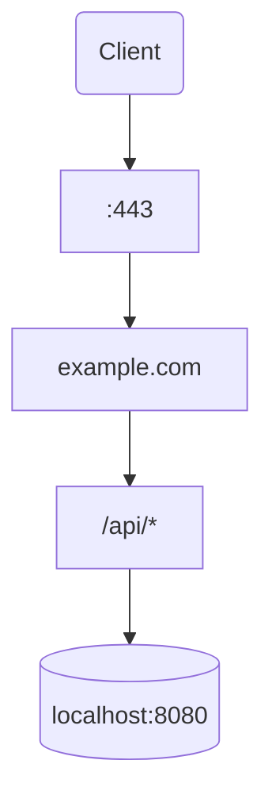

# RouteGraph

**RouteGraph** — это библиотека и CLI-инструмент на Rust, который читает конфигурации reverse proxy и строит визуальное представление маршрутизации запросов в виде графа.

## Пример



## Установка

```bash
cargo install routegraph-cli
```

## Использование (CLI)

```bash
# Parse Caddyfile and show routing summary
routegraph parse Caddyfile

# Render as Mermaid diagram
routegraph render mermaid Caddyfile

# Render as Graphviz DOT
routegraph render dot Caddyfile | dot -Tpng -o routes.png

# Custom title
routegraph render mermaid Caddyfile --title "My Routes"

# From stdin
cat Caddyfile | routegraph parse -
```

## Использование (library)

```rust
use routegraph_core::prelude::*;
use routegraph_caddy::CaddyParser;
use routegraph_renderer_mermaid::MermaidRenderer;

let parser = CaddyParser::new();
let graph = parser.parse(&caddy_config)?;

let renderer = MermaidRenderer::new();
let output = renderer.render(&graph)?;
println!("{output}");
```

## Workspace crates

| Crate | Description |
|-------|-------------|
| `routegraph-core` | Модель данных графа, трейты `Parser` / `Renderer` / `FormatDetector` |
| `routegraph-caddy` | Парсер Caddyfile |
| `routegraph-renderer-dot` | Graphviz DOT renderer |
| `routegraph-renderer-mermaid` | Mermaid flowchart renderer |
| `routegraph-cli` | CLI binary |

## Supported formats

| Format | Status |
|--------|--------|
| Caddyfile | ✅ MVP |
| Nginx | Planned |
| Tiny Proxy | Planned |
| Traefik | Planned |
| Envoy | Planned |
| HAProxy | Planned |
| Kubernetes Ingress | Planned |
| Kubernetes Gateway API | Planned |

## Архитектура

См. [ARCHITECTURE.md](ARCHITECTURE.md) — полная документация по дизайну, модели данных, трейтам и roadmap.

## License

Licensed under either of [Apache License, Version 2.0](LICENSE-APACHE) or [MIT license](LICENSE-MIT) at your option.

Unless you explicitly state otherwise, any contribution intentionally submitted for inclusion in this crate by you, as defined in the Apache-2.0 license, shall be dual licensed as above, without any additional terms or conditions.
