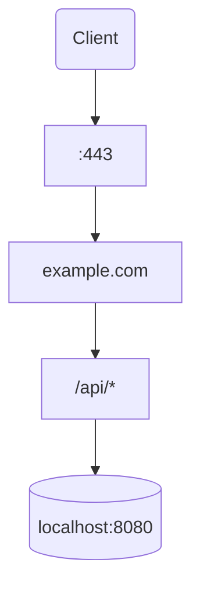

# RouteGraph

**RouteGraph** is a Rust library and CLI tool that reads reverse proxy configurations and visualizes request routing as directed graphs.

## Example



## Installation

```bash
cargo install routegraph
```

## Usage (CLI)

```bash
# Parse Caddyfile and show routing summary
routegraph parse Caddyfile

# Render as Mermaid diagram
routegraph render mermaid Caddyfile

# Render as Graphviz DOT
routegraph render dot Caddyfile | dot -Tpng -o routes.png

# Custom title
routegraph render mermaid Caddyfile --title "My Routes"

# From stdin
cat Caddyfile | routegraph parse -
```

## Usage (Library)

```rust
use routegraph::prelude::*;

let parser = CaddyParser::new();
let graph = parser.parse(&caddy_config)?;

let renderer = MermaidRenderer::new();
let output = renderer.render(&graph);
println!("{output}");
```

## Supported Formats

| Format | Status |
|--------|--------|
| Caddyfile | ✅ MVP |
| Nginx | Planned |
| Tiny Proxy | Planned |
| Traefik | Planned |
| Envoy | Planned |
| HAProxy | Planned |
| Kubernetes Ingress | Planned |
| Kubernetes Gateway API | Planned |

## Architecture

See [ARCHITECTURE.md](ARCHITECTURE.md) for full design documentation, data model, traits, and roadmap.

## License

Licensed under either of [Apache License, Version 2.0](LICENSE-APACHE) or [MIT license](LICENSE-MIT) at your option.

Unless you explicitly state otherwise, any contribution intentionally submitted for inclusion in this crate by you, as defined in the Apache-2.0 license, shall be dual licensed as above, without any additional terms or conditions.